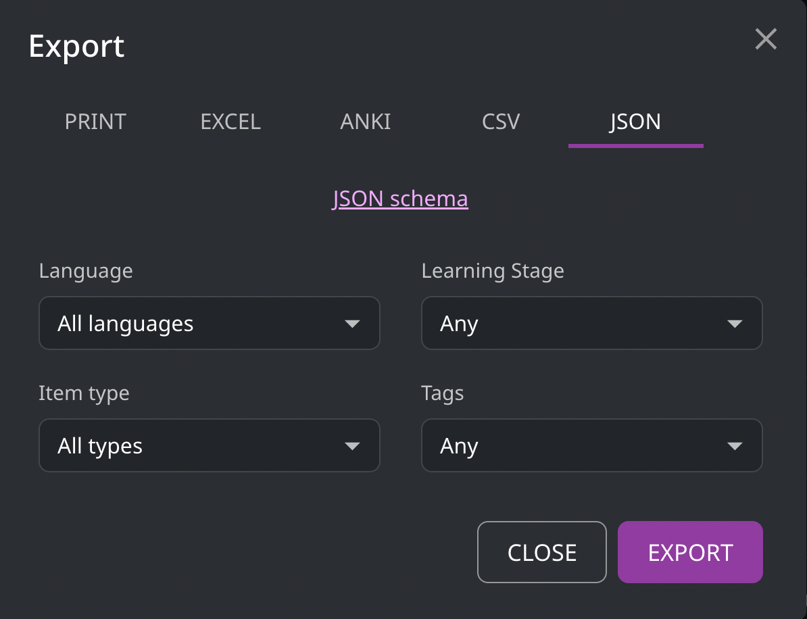
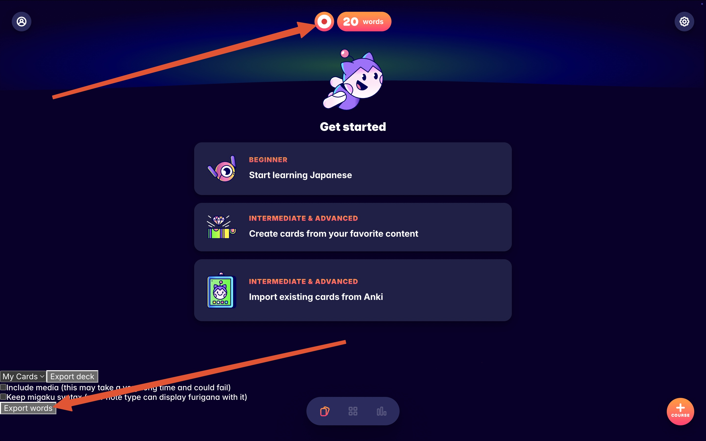
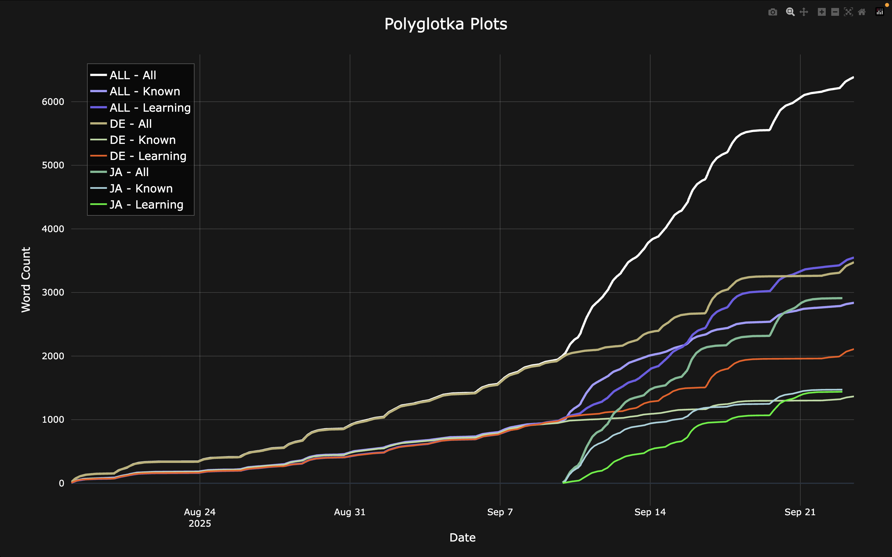
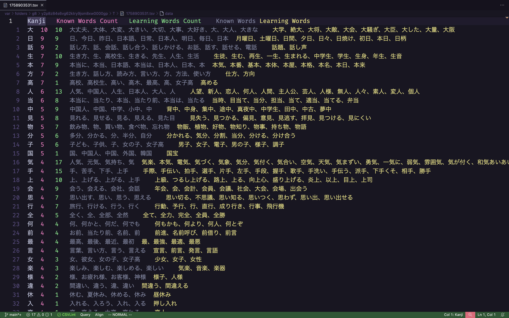
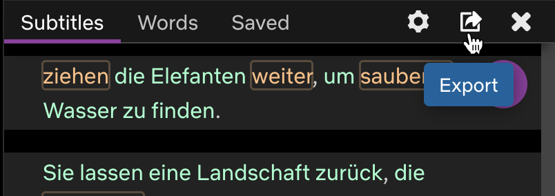
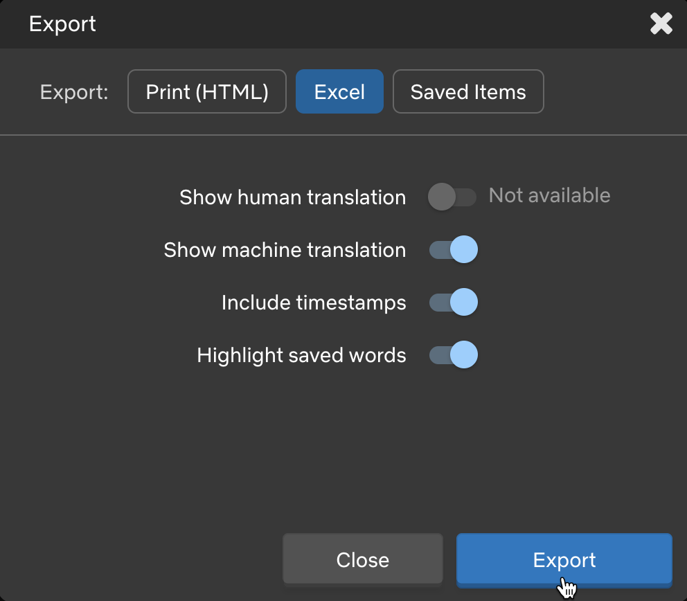

# Polyglotka

Export data from Language Reactor and Migaku, convert subs, track your language acquisition progress with interactive plots and kanji tables.

## Name

_Polyglotka_ is a [Slovak word](https://www.google.com/search?q=%22polyglotka%22+site%3A*.sk)
that means _female polyglot_.
For example, [Lýdia Machová](https://www.wikiwand.com/sk/articles/L%C3%BDdia_Machov%C3%A1)
is a famous polyglotka.

## Install

Use [pipx](https://pipx.pypa.io):

    pipx install git+https://github.com/constkolesnyak/polyglotka

## Export Data

### From Language Reactor

1. On the Language Reactor website, open your [saved items](https://www.languagereactor.com/saved-items).

2. Click _Export_, choose _JSON_, _All-All-Any-Any_, and click _Export_ again.

   

### From Migaku

1. Add
   [Migaku Memory Exporter](https://github.com/constkolesnyak/migaku-memory-exporter/blob/main/migaku_exporter.js)
   to your userscript manager.

2. Go to [Migaku Memory](https://study.migaku.com).

3. Select a language, click _Export words_, repeat for every language you study.

   

## Configure

Set environment variables with the `POLYGLOTKA_` prefix or pass flags directly.

    # The title's gonna be "Flag title" (flags take priority over env vars)
    POLYGLOTKA_PLOTS_TITLE='Env title' polyglotka plots --plots-title 'Flag title'

### Variables

| Name                   | Type    | Default                | Description                           |
| ---------------------- | ------- | ---------------------- | ------------------------------------- |
| EXPORTED_FILES_DIR     | str     | $HOME/Downloads        | Directory with exported files         |
| SRT_SUBS_TARGET_DIR    | str     | LR_SUBS_DIR            | Directory for generated SRT subs      |
| PROCESSED_FILES_RM     | str     | True                   | Remove processed files                |
| PLOTS_TITLE            | str     | Polyglotka Plots       | Title of the plots                    |
| PLOTS_BACKGROUND_COLOR | str     | \#171717               | Background color (dark by default)    |
| PLOTS_SMOOTH           | bool    | True                   | Smoothing for cleaner visuals         |
| PLOTS_HIDE_AGGR        | bool    | True                   | Hide aggregate plots until toggled    |
| ANKI_MIN_COUNTS        | int,int | 0,0                    | Min counts for (known,learning) words |
| ANKI_FILTERS           | str     | deck:漢字 is:suspended | Anki search query filters             |
| ANKI_KANJI_FIELD       | str     | kanji                  | Anki field name containing kanji      |

See more variables [here](src/polyglotka/common/config.py) or [here](#polyglotka-info).

## `polyglotka plots`

Interactive plots will open in your browser.

Zoom in, zoom out, toggle plots, download a picture, push every button in the corner, have fun.

## `polyglotka kanji`

Pipe the TSV output into [this function](https://github.com/constkolesnyak/dotfiles/blob/3b225ee11388b1c6074caee54ba37e9bb5dc87d2/zsh/.functions.zsh#L1)
from my dotfiles to open VS Code with [Rainbow CSV](https://marketplace.visualstudio.com/items?itemName=mechatroner.rainbow-csv):

    polyglotka kanji | codetemp tsv

The table shows kanji ordered by the number of known words, then learning words.

## `polyglotka anki`

Generate the search query for kanji with the highest counts of known and learning words. `ANKI_MIN_COUNTS` trims the less frequent ones.

To get kanji that appear in at least 7 known words and 9 learning words, run:

    polyglotka anki --anki-min-counts 7,9

Output:

    deck:漢字 is:suspended (kanji:大 OR kanji:日 OR kanji:話 OR kanji:生 OR kanji:本)

On macOS, pipe the output directly into the clipboard if you are in a hurry:

    polyglotka anki --anki-min-counts 7,9 | pbcopy

Then paste the search query into Anki.

## `polyglotka words`

Just prints words.

    polyglotka words --lang de --stage known | head -n 5

Output:

    Abend
    Abrakadabra
    Action
    Adjutant
    Adresse

## `polyglotka subs`

Convert LR's Excel subs to SRT to import them to Migaku.

Here's how to export Excel subs:

#### 1.

#### 2.

## `polyglotka info`

Print config and other miscellaneous info.

## `polyglotka clear-cache`

Clear cache.
